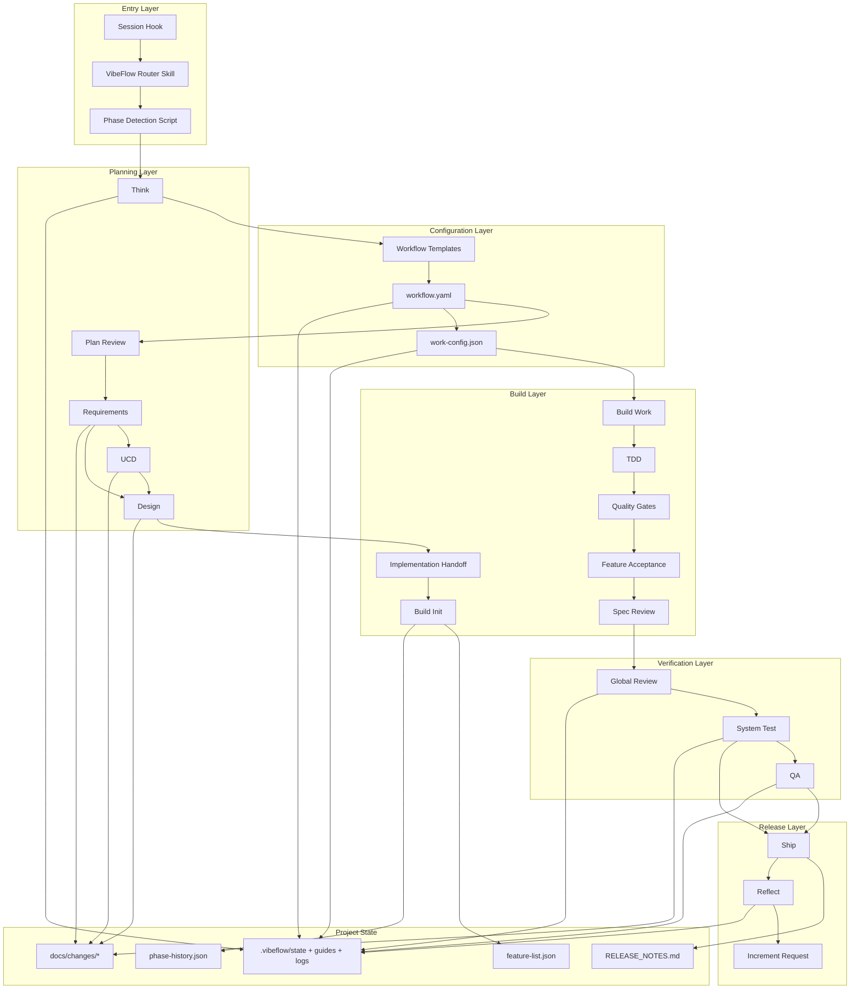
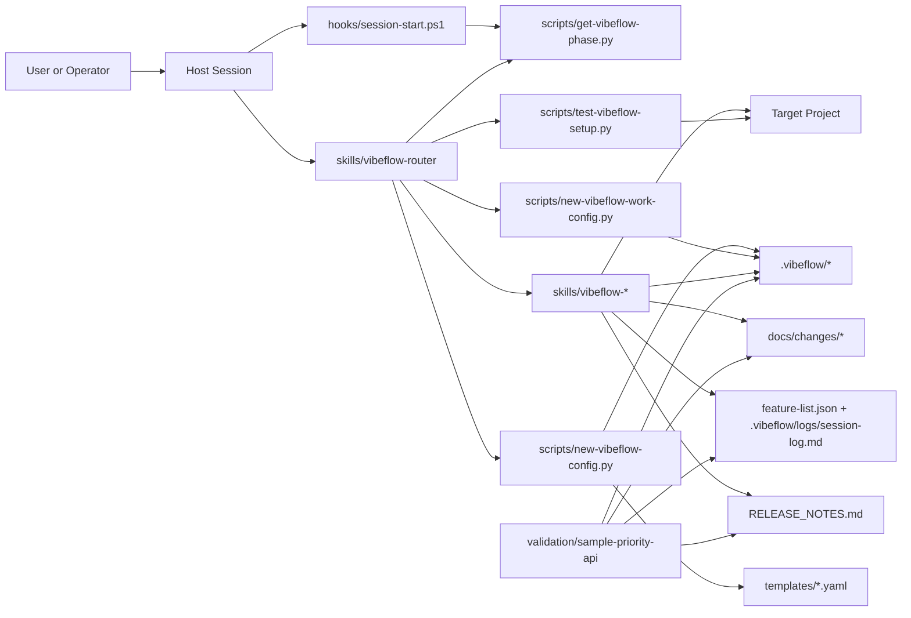
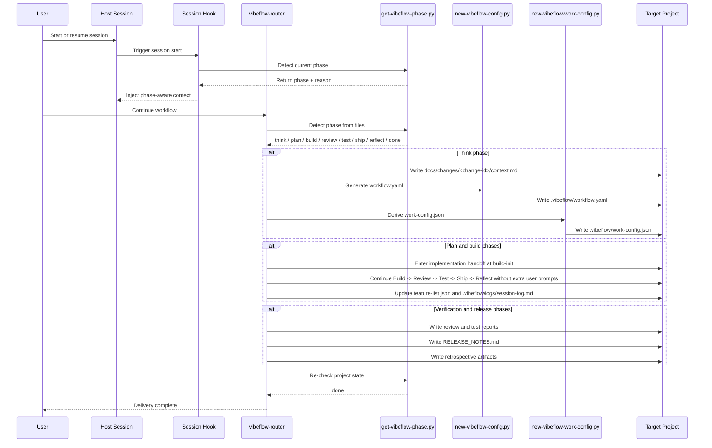

# VibeFlow 架构详解

## 7 阶段架构

```
┌─────────────────────────────────────────────────────────────┐
│  决策阶段（人工参与）                                          │
│  Think → Plan → Requirements → Design                       │
│  人做判断、做审批、做签字确认                                  │
└─────────────────────────────────────────────────────────────┘
                              │
                              ▼
┌─────────────────────────────────────────────────────────────┐
│  执行阶段（自动接管）                                          │
│  Build → Review → Test                                      │
│  进入 build-init 后默认由系统自动继续到结束或阻塞               │
└─────────────────────────────────────────────────────────────┘
                              │
                         ┌────┴────┐
                         ▼         ▼
                       Ship    Reflect
                         │         │
                         └── 可选 ──┘
```

### 7 个核心阶段

| 阶段 | 性质 | 说明 |
|------|------|------|
| Think | 人工 | 问题框定、模板选择 |
| Plan | 人工 | CEO 视角价值评审（fail-fast 关卡）|
| Requirements | 人工 | 需求规格说明书（ISO 29148）|
| Design | 人工 | 技术设计 + 三视角评审 + 用户签字 |
| Build | 自动 | 构建初始化 → 功能配置 → 实现（TDD 管道）|
| Review | 自动 | 跨功能审查（架构、安全、性能）|
| Test | 自动 | 系统测试 + QA 验证 |

### 2 个可选阶段

**Ship（发布）** 和 **Reflect（反思）** 是可选阶段，根据项目配置决定是否执行。

---

## 决策阶段详解

### Think（思考）

**目标**：定义问题、理解边界、扫描机会、选择工作流模板。

- 产出 `docs/changes/<change-id>/context.md`：本次工作的起点说明
- 可选：先跑一轮 `vibeflow-office-hours`（YC Office Hours 风格头脑风暴）
- 推荐并确认模板（prototype / web-standard / api-standard / enterprise）

### Plan（计划）

**目标**：CEO 视角价值评审，唯一关卡。

- 调用 `vibeflow-plan-value-review` 评估项目价值
- **价值评审失败 = 项目终止**（fail-fast）
- 工程视角和设计视角评审移到 Design 阶段末尾执行

### Requirements（需求）

**目标**：编写需求规格说明书（SRS），遵循 ISO/IEC/IEEE 29148。

- 产出 `docs/changes/<change-id>/requirements.md`
- 逐条与用户确认，每条需求可测试

### Design（设计）

**目标**：技术设计 + 用户体验设计 + 三视角评审。

| 步骤 | Skill | 产出物 |
|------|-------|--------|
| 0. 问题探索 | `vibeflow-brainstorming`（可选）| `docs/plans/*-brainstorming.md` |
| 1. 读取 SRS + UCD | 内置 | 设计驱动提取 |
| 2. 探索上下文 | 内置 | 上下文文档 |
| 3. 提出方案 | 内置 | 方案对比 |
| 4. 用户逐节审批 | 内置 | 用户签字确认 |
| 5. AI 深度评审 | `vibeflow-plan-eng-review` + `vibeflow-plan-design-review` | `docs/changes/<change-id>/design-review.md` |
| 6. 范围决策 | 内置 | Expand / Hold / Reduce |
| 7. 编写设计文档 | 内置 | `docs/changes/<change-id>/design.md` |

---

## 执行阶段详解

### Build（构建）

**目标**：进入 Build 后由系统自动继续后续链路。

在 Claude Code 插件里，进入 `build-init` 后默认开始自动继续后续链路。

Build 阶段负责完成以下全部工作：

| 步骤 | 内容 | 产出 |
|------|------|------|
| 初始化 | 创建脚手架文件 | `feature-list.json`、`.vibeflow/runtime.json` 等 |
| 功能配置 | 分配每个功能的开发/测试阶段 | `feature-list.json`（更新后的功能状态）|
| 实现 | 串行或依赖感知并行构建 | 源代码、测试文件、`.vibeflow/build-reports/feature-*.md` |
| 质量门禁 | 行覆盖率、分支覆盖率、变异测试 | 覆盖率报告 |
| 功能验收 | Feature-ST + Spec-Review | 验收报告 |

```
Design 确认
    │
    ▼
Build-init ── Build-config ── Build-work
    │              │             │
    │              │         ┌────┴────┐
    │              │         ▼         ▼
    │              │    TDD 循环  Quality Gates
    │              │         │         │
    │              │         ▼         ▼
    │              │   Feature-ST  Spec-Review
    │              │         │         │
    │              │         └────┬────┘
    │              │              ▼
    │              │         Acceptance
    │              │              │
    └──────────────┴──────────────┘
                   │
                   ▼
              Review（自动）
```

### Review（审查）

**目标**：跨功能整体变更审查（自动完成）。

- `vibeflow-review`：架构一致性、安全性、性能分析
- 可选激活安全护栏：`vibeflow-careful`、`vibeflow-freeze`、`vibeflow-guard`

### Test（测试）

**目标**：系统级集成测试和 QA 验证（自动完成）。

| 步骤 | 内容 | 触发条件 |
|------|------|---------|
| Test-System | 集成测试、E2E、NFR 验证、探索性测试 | 所有项目 |
| Test-QA | 浏览器驱动 QA 验证 | 仅 UI 项目 |

Test-QA 发现的问题：
- **严重/重要**：自动修复后重新验证
- **次要/外观**：与用户确认是否修复或推迟

---

## Skill 超能力架构

VibeFlow 由 **23 个独立 Skill** 组成，分为五层：

### 核心层

| Skill | 职责 |
|-------|------|
| `vibeflow` | 框架入口，概览和快速开始 |
| `vibeflow-router` | 会话路由器，基于文件状态分派到正确阶段 |
| `vibeflow-think` | Think 阶段，问题框定和模板选择 |

### 计划层

| Skill | 职责 |
|-------|------|
| `vibeflow-plan` | Plan 阶段入口 |
| `vibeflow-plan-value-review` | CEO 视角价值评审，fail-fast 关卡 |
| `vibeflow-plan-eng-review` | 工程视角评审 |
| `vibeflow-plan-design-review` | 设计视角评审 |
| `vibeflow-requirements` | 需求规格说明书 |
| `vibeflow-design` | 技术设计（含 UCD 内联 + 三视角评审）|

### 构建层

| Skill | 职责 |
|-------|------|
| `vibeflow-build-init` | 初始化构建产物 |
| `vibeflow-build-config` | 配置每个功能的实现细节 |
| `vibeflow-build-work` | 单功能编排器 |
| `vibeflow-tdd` | TDD Red-Green-Refactor 循环 |
| `vibeflow-quality` | 质量门禁 |
| `vibeflow-feature-st` | 功能级验收测试 |
| `vibeflow-spec-review` | 规范合规性审查 |

### 安全护栏

| Skill | 职责 |
|-------|------|
| `vibeflow-careful` | 危险命令警告 |
| `vibeflow-freeze` | 编辑边界限制 |
| `vibeflow-guard` | 最大安全模式 |
| `vibeflow-unfreeze` | 解除冻结 |

### 验证与发布层

| Skill | 职责 |
|-------|------|
| `vibeflow-review` | 跨功能整体变更审查 |
| `vibeflow-test-system` | 系统级集成测试 |
| `vibeflow-test-qa` | 浏览器驱动的 QA 验证 |
| `vibeflow-ship` | 版本发布 |
| `vibeflow-reflect` | 迭代回顾 |

---

## 模板系统

四种静态模板控制工作流严格度：

| 维度 | Prototype | Web-Standard | API-Standard | Enterprise |
|------|-----------|--------------|--------------|------------|
| **Think 深度** | quick | standard | standard | deep |
| **Plan 评审** | CEO 削减模式 | CEO 保持模式 | CEO 保持模式 | CEO 扩展模式 |
| **需求规格** | 必需 | 必需 | 必需 | 必需 |
| **TDD** | 必需 | 必需 | 必需 | 必需 |
| **行覆盖率** | 60% | 90% | 90% | 95% |
| **分支覆盖率** | 40% | 80% | 80% | 85% |
| **变异分数** | 50% | 80% | 80% | 85% |
| **功能验收** | 可选 | 必需 | 可选 | 必需 |
| **规范审查** | 可选 | 必需 | 必需 | 必需 |
| **全局审查** | 可选 | 必需 | 必需 | 必需 |
| **系统测试** | 可选 | 必需 | 必需 | 必需 |
| **反思** | 可选 | 可选 | 可选 | 必需 |
| **适用场景** | 黑客马拉松、POC | Web 应用 | API 服务 | 企业/合规系统 |

---

## 项目状态文件

### 运行时状态（`.vibeflow/`）

| 文件 | 用途 |
|------|------|
| `state.json` | 工作流中心状态：当前阶段、模式、活跃工作包 |
| `runtime.json` | 运行态覆盖层：记录 Build 后自动执行链路的当前动作 |
| `workflow.yaml` | 当前生效的工作流配置 |
| `work-config.json` | 构建配置：启用的步骤、质量阈值 |
| `phase-history.json` | 阶段推进历史 |
| `logs/session-log.md` | 人类可读的过程日志 |

### 交付产物

| 文件 | 用途 |
|------|------|
| `docs/changes/<change-id>/context.md` | 问题上下文文档 |
| `docs/changes/<change-id>/requirements.md` | 需求规格说明书 |
| `docs/changes/<change-id>/design.md` | 技术设计文档 |
| `docs/changes/<change-id>/design-review.md` | 设计评审结果 |
| `feature-list.json` | 功能清单主索引 |
| `RELEASE_NOTES.md` | 发布说明 |

---

## 各阶段技术实现详解

### Think 阶段

**技术职责**：建立项目起点，生成 context.md，确定工作范围。

**文件写入**：
```
docs/changes/<change-id>/context.md
```

**context.md 结构**：
```markdown
# <change-id> Context

## 问题陈述
<用户描述的问题>

## 约束条件
- 技术约束
- 时间/资源约束

## 机会扫描
<发现的机会点>

## 模板选择
[Prototype | Web-Standard | API-Standard | Enterprise]
```

**技术细节**：Think 阶段读取 `.vibeflow/workflow.yaml` 获取当前配置的模板参数，但不修改状态文件。模板选择结果写入 context.md。

**Router 触发**：Think 完成后，Router 检查 `docs/changes/<change-id>/context.md` 存在，自动路由到 Plan 阶段。

---

### Plan 阶段

**技术职责**：价值评审，fail-fast 关卡。

**核心 Skill**：`vibeflow-plan-value-review`

**评审维度**（六个 CEO 问题）：
1. 现实扭曲场——用户痛点是否真实存在
2. 第一性原理——问题根因是否被正确理解
3. 10 倍改进——方案是否比现状好一个量级
4. 最窄突破口——切入点是否足够细
5. 观察者视角——是否考虑了竞争和替代方案
6. 退出策略——如果失败了怎么办

**文件写入**：
```
docs/changes/<change-id>/plan-value-review.md
```

**fail-fast 逻辑**：
```typescript
// 如果价值评审不通过，整个项目终止
if (reviewResult === 'FAIL') {
  state.phase = 'TERMINATED'
  writeState(state)
  return '项目终止'
}
```

**技术细节**：Plan 阶段不修改 `state.json`，只在评审通过后才更新状态。这保证了评审具有真正的否决权。

---

### Requirements 阶段

**技术职责**：将用户需求转化为可测试的需求规格说明书。

**标准**：ISO/IEC/IEEE 29148

**需求格式**：
```markdown
## REQ-<id>: <需求标题>

**类型**：Functional | Non-Functional | Constraint
**优先级**：Must | Should | Could | Won't
**描述**：<需求描述>

### 验收标准（Given/When/Then）

**Given** <前置条件>
**When** <操作>
**Then** <预期结果>
```

**MoSCoW 优先级**：
- Must——阻塞发布
- Should——影响体验
- Could——锦上添花
- Won't——本期不做

**文件写入**：
```
docs/changes/<change-id>/requirements.md
```

**技术细节**：Requirements 阶段的产出直接被 Design 阶段消费。Design 阶段的 UCD（Use Case Diagram）从 REQ 的 Given/When/Then 提取。

---

### Design 阶段

**技术职责**：技术设计 + 三视角评审 + 用户签字确认。

**子步骤执行顺序**：

```
1. 读取 SRS + UCD
       ↓
2. 探索上下文（与用户交互）
       ↓
3. 提出方案（至少 2 个方案对比）
       ↓
4. 用户逐节审批（每个设计决策需要用户确认）
       ↓
5. AI 工程评审（vibeflow-plan-eng-review）
       ↓
6. AI 设计评审（vibeflow-plan-design-review）
       ↓
7. 范围决策（Expand / Hold / Reduce）
       ↓
8. 编写设计文档
```

**Design 文档结构**：
```markdown
# <change-id> Design

## 架构概览
<高层架构描述>

## 数据模型
<数据模型设计>

## API 设计
<RESTful API 接口定义>

## 技术选型
<技术栈选择及理由>

## 风险评估
<识别到的风险及缓解措施>
```

**三视角评审**：

| 视角 | 关注点 | Skill |
|------|--------|-------|
| CEO | 价值、市场、时机 | vibeflow-plan-value-review（复用） |
| 工程 | 架构、安全、性能 | vibeflow-plan-eng-review |
| 设计 | UX、信息架构、交互 | vibeflow-plan-design-review |

**用户签字确认**：Design 文档需要用户在每个章节签字确认。如果用户拒绝某个设计决策，该决策需要重新设计。

**文件写入**：
```
docs/changes/<change-id>/design.md
docs/changes/<change-id>/design-review.md
```

---

### Build 阶段

**技术职责**：TDD 驱动开发，质量门禁，功能验收。

**自动继续机制**：进入 `build-init` 后，Router 自动继续后续链路，直到遇到阻塞点。

**子步骤执行**：

```
build-init → build-config → build-work
                              │
                         ┌────┴────┐
                         ▼         ▼
                    TDD 循环   Quality Gates
                         │         │
                         ▼         ▼
                   Feature-ST   Spec-Review
                         │         │
                         └────┬────┘
                              ▼
                         Acceptance
```

**build-init 技术细节**：
```json
{
  "phase": "build",
  "action": "build-init",
  "created": {
    "feature-list.json": "<功能清单模板>",
    ".vibeflow/runtime.json": "<运行时状态>",
    ".vibeflow/logs/session-log.md": "<会话日志>"
  }
}
```

**feature-list.json 结构**：
```json
{
  "change-id": "<change-id>",
  "features": [
    {
      "id": "feature-1",
      "name": "登录功能",
      "status": "pending",
      "tdd": { "red": false, "green": false, "refactor": false },
      "quality": { "coverage": 0, "mutation": 0 },
      "acceptance": false
    }
  ]
}
```

**TDD 循环技术实现**：

```typescript
// TDD 循环
async function tddCycle(feature: Feature) {
  // Red: 写一个会失败的测试
  writeTest(feature, 'red')
  runTests() // 必须失败

  // Green: 写最少的代码让测试通过
  implementFeature(feature)
  runTests() // 必须通过

  // Refactor: 重构代码
  refactorCode(feature)
  runTests() // 必须通过
}
```

**Quality Gates 技术细节**：

| 门禁 | Prototype | Web-Standard | API-Standard | Enterprise |
|------|-----------|--------------|--------------|------------|
| 行覆盖率 | 60% | 90% | 90% | 95% |
| 分支覆盖率 | 40% | 80% | 80% | 85% |
| 变异分数 | 50% | 80% | 80% | 85% |

```typescript
// 质量门禁检查
async function checkQualityGates(feature: Feature): Promise<boolean> {
  const coverage = await runCoverage()
  const mutation = await runMutationTesting()

  if (coverage < template.coverageThreshold) return false
  if (mutation < template.mutationThreshold) return false

  return true
}
```

**Parallel Mode（build-work）**：

当功能之间没有依赖时，可以使用并行模式同时构建多个功能：

```typescript
// 依赖感知的并行执行
async function buildFeatures(features: Feature[]) {
  const dependencyGraph = buildGraph(features)
  const executed = new Set<string>()

  for (const batch of dependencyGraph.layers) {
    await Promise.all(
      batch.map(f => buildFeature(f, executed))
    )
    executed.add(batch.map(f => f.id))
  }
}
```

---

### Review 阶段

**技术职责**：跨功能整体审查，架构一致性、安全性、性能分析。

**审查维度**：

| 维度 | 检查内容 |
|------|----------|
| 架构一致性 | 各模块是否符合 design.md 中的架构决策 |
| 安全性 | 是否有 SQL 注入、XSS、CSRF 等漏洞 |
| 性能 | 关键路径是否有 N+1 查询、内存泄漏 |
| 可维护性 | 代码结构、复杂度、重复代码 |

**文件写入**：
```
.vibeflow/build-reports/review-<timestamp>.md
```

---

### Test 阶段

**技术职责**：系统级集成测试、E2E 测试、NFR 验证。

**Test-System 执行**：

| 测试类型 | 触发条件 | 技术实现 |
|----------|----------|----------|
| 集成测试 | 所有项目 | jest --config integration.config.js |
| E2E 测试 | UI 项目 | playwright |
| NFR 验证 | 性能要求项目 | k6 load testing |
| 探索性测试 | 可选 | gstack 自动化探索 |

**Test-QA 执行**：

```typescript
// QA 测试流程
async function runQA(): Promise<QAReport> {
  const browser = await launchBrowser()

  for (const testCase of qaTestCases) {
    await browser.goto(testCase.url)
    await browser.interact(testCase.actions)
    const screenshot = await browser.screenshot()

    if (!matchesExpected(testCase, screenshot)) {
      qaReport.addIssue(testCase, screenshot)
    }
  }

  return qaReport
}
```

**问题分级处理**：

| 严重程度 | 处理方式 |
|----------|----------|
| 严重/重要 | 自动修复后重新验证 |
| 次要/外观 | 与用户确认是否修复 |

---

### Ship 阶段

**技术职责**：版本发布，生成发布产物。

**产出**：
```
RELEASE_NOTES.md
CHANGELOG.md
<version-tag>
```

**Ship 流程**：
```typescript
async function ship(): Promise<ShipResult> {
  // 1. 生成 Release Notes
  const releaseNotes = generateReleaseNotes(changes)

  // 2. 创建版本标签
  await git.tag(`v${version}`, `-m "Release v${version}"`)

  // 3. 更新 CHANGELOG
  await updateChangelog(releaseNotes)

  // 4. 推送
  await git.push('--tags')

  return { version, releaseNotes, tag }
}
```

---

### Reflect 阶段

**技术职责**：迭代复盘，生成改进建议。

**产出**：
```
.vibeflow/logs/retro-<YYYY-MM-DD>.md
```

**Retro 文档结构**：
```markdown
# 迭代回顾 <date>

## 做得好的
- <what worked>

## 需要改进的
- <what didn't work>

## 下次迭代的行动项
- <action items>
```

---

## 状态机转换

```
                    ┌─────────────────────────────────────┐
                    │                                     │
                    ▼                                     │
Think ──► Plan ──► Requirements ──► Design ──► Build ──► Review ──► Test
                    │                   │            │
                    │                   │            │
                    ▼                   ▼            ▼
              [TERMINATED]      [USER_CONFIRM]  [Ship/Reflect]
                                                   │
                                              ┌────┴────┐
                                              ▼         ▼
                                           Ship     Reflect
                                              │         │
                                              └── [END]─┘
```

**状态转换规则**：
1. Plan 失败 → TERMINATED（项目终止）
2. Design 需要用户确认 → USER_CONFIRM（阻塞等待）
3. Build 遇到质量门禁失败 → 停在当前功能，等待修复
4. Test 发现严重问题 → 返回 Build 修复
5. Ship/Reflect 完成后 → END（流程结束）

---

## 完整架构流程图



---

## 组件关系图



---

## 时序图



---

## 设计原则

1. **Vendor-neutral 项目表面** — 所有项目-facing 名称统一使用 `vibeflow`

2. **文件驱动路由** — 当前阶段从仓库状态推断，而不是从聊天历史

3. **薄编排层** — Skills 定义路由和契约，实现细节留在目标项目和执行管道中

4. **模板派生行为** — 工作流严格度一次性选择，通过生成的配置传播

5. **仓库本地产物** — 恢复或继续所需的所有状态存在于文件，而不是进程内存

---

## 脚本层

| 脚本 | 职责 |
|------|------|
| `get-vibeflow-phase.py` | 检测当前工作流阶段 |
| `new-vibeflow-config.py` | 从模板生成 workflow.yaml |
| `new-vibeflow-work-config.py` | 从 workflow.yaml 派生 work-config.json |
| `test-vibeflow-setup.py` | 验证仓库就绪状态 |
| `vibeflow_codebase.py` | 项目代码结构地图维护 |
| `vibeflow_packets.py` | 增量请求处理 |
| `map-change-impact.py` | 变更影响分析 |
| `map-codebase.py` | 代码库结构映射 |

---

## Hooks 层

| 文件 | 职责 |
|------|------|
| `hooks.json` | Hook 配置清单 |
| `session-start.ps1` | Windows 会话启动钩子 |
| `session-start.sh` | Unix 会话启动钩子 |

Hooks 负责在会话开始时注入学期-aware 上下文，桥接主机钩子入口到 Python 路由逻辑。

---

## 验证架构

VibeFlow 使用独立样本项目验证架构，而不是用 VibeFlow 仓库本身作为交付目标。

样本验证项目：`validation/sample-priority-api`

验证属性：
- 工作流从 Think 开始
- workflow.yaml 和 work-config.json 可以外部生成
- 规划产物可以在目标项目中生成
- 路由能识别 build/test/release 产物
- 交付证据齐全后路由达到 `done`

---

## 交付产物清单

### VibeFlow 运行时状态（`.vibeflow/`）

| 文件 | 用途 |
|------|------|
| `state.json` | 工作流中心状态：当前阶段、模式、活跃工作包 |
| `state.json.quick_meta` | Quick Mode 资格、风险、验证、回滚、提升规则 |
| `runtime.json` | 运行态覆盖层：记录 Build 后自动执行链路的当前动作 |
| `workflow.yaml` | 工作流配置（从模板生成） |
| `work-config.json` | 构建配置：质量门禁、启用的步骤 |
| `guides/build.md` | Build 会话指南 |
| `guides/services.md` | 服务生命周期指南（当有服务时） |
| `logs/session-log.md` | 人类可读的过程日志 |
| `logs/retro-YYYY-MM-DD.md` | 迭代回顾 |
| `increments/queue.json` | 待处理增量队列 |
| `increments/requests/*.json` | 增量请求载荷 |
| `increments/history.json` | 增量处理历史 |

### 项目交付产物

| 文件 | 用途 |
|------|------|
| `docs/changes/<change-id>/context.md` | Think 产物：问题上下文 |
| `docs/changes/<change-id>/proposal.md` | Plan 产物：价值评审 |
| `docs/changes/<change-id>/requirements.md` | 需求规格说明书（SRS）|
| `docs/changes/<change-id>/ucd.md` | UCD：用例图（当有 UI 时）|
| `docs/changes/<change-id>/design.md` | 技术设计文档 |
| `docs/changes/<change-id>/design-review.md` | 工程 + 设计评审结论 |
| `docs/changes/<change-id>/tasks.md` | Build 任务分解 |
| `docs/changes/<change-id>/verification/review.md` | 全局审查报告 |
| `docs/changes/<change-id>/verification/system-test.md` | 系统测试报告 |
| `docs/changes/<change-id>/verification/qa.md` | QA 测试报告（UI 项目）|
| `docs/plans/*-brainstorming.md` | 头脑风暴输出（可选）|
| `docs/test-cases/feature-*.md` | 功能测试用例文档 |
| `feature-list.json` | 功能清单（Build 期间单一真相源）|
| `RELEASE_NOTES.md` | 发布说明 |

---

## 路由状态机详解

路由器实现为确定性状态机。

### 检测策略

阶段检测基于文件存在性和功能状态：

| 状态 | 推断阶段 |
|------|----------|
| 缺少 think 输出 | increment |
| 缺少 workflow.yaml | template-selection |
| 缺少 plan/design 产物 | plan |
| 缺少功能清单或功能未通过 | build |
| 缺少 review/test 报告 | review |
| 缺少 release notes 或回顾 | ship/reflect |
| 所有交付证据齐全 | done |

这种设计使恢复会话具有确定性和可恢复性。

### 完整阶段列表

1. `increment`
2. `think`
3. `template-selection`
4. `plan`
5. `requirements`
6. `design`
7. `build-init`
8. `build-config`
9. `build-work`
10. `review`
11. `test-system`
12. `test-qa`
13. `ship`
14. `reflect`
15. `done`

---

## 扩展模型

未来扩展应保持以下边界：

- 新阶段应扩展路由器并添加明确的产物
- 新模板应添加为静态 YAML 文件
- 新验证项目应放在 `validation/` 下
- 主机特定集成可在 hooks 中演进，但编排逻辑应留在 Python 脚本中
